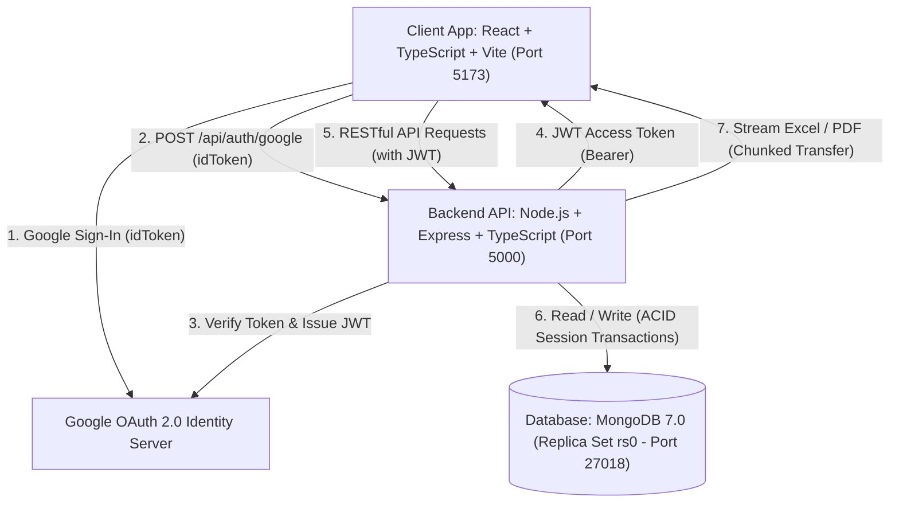

# 🏗️ Kiến trúc Hệ thống (System Architecture)

Tài liệu này mô tả chi tiết kiến trúc kỹ thuật tổng thể, ngăn xếp công nghệ (Tech Stack), luồng dữ liệu (Data Flow) và mô hình đóng gói container của dự án Expense Tracker.

---

## 🏛️ Sơ đồ Kiến trúc Tổng thể (High-Level Architecture)



---

## 🛠️ Ngăn xếp Công nghệ (Technology Stack)

### 1. Phía Giao diện (Frontend - Client)
* **Framework:** React 18 + TypeScript + Vite.
* **Định tuyến:** React Router DOM v6.
* **Giao diện & Trải nghiệm:** Facebook Design System (CSS Custom Properties), Hỗ trợ Light / Dark Mode, Hệ thống Animated Popup Dialog & Toast Notifications.
* **Bộ Icon vector:** `lucide-react`.
* **Xác thực:** `@react-oauth/google`.
* **Giao tiếp HTTP:** Axios + Fetch API (hỗ trợ blob stream download).

### 2. Phía Máy chủ (Backend - Server)
* **Nền tảng:** Node.js 20 LTS + Express.js + TypeScript.
* **Cơ sở dữ liệu:** Mongoose ODM kết nối MongoDB Replica Set.
* **Bảo mật:** JWT (`jsonwebtoken`), Google Auth Library (`google-auth-library`), CORS, Helmet, Rate Limiting ready.
* **Kiểm tra dữ liệu (Validation):** `zod`.
* **Xuất báo cáo Streaming:**
  * Excel: `exceljs` (WorkbookWriter stream).
  * PDF: `pdfkit` (Document pipe stream + Unicode TrueType Fonts).

### 3. Cơ sở dữ liệu & Triển khai (Database & DevOps)
* **Database:** MongoDB 7.0 với Replica Set (`rs0`) hỗ trợ Multi-Document ACID Transactions.
* **Containerization:** Docker & Docker Compose đa container (`expense_client`, `expense_server`, `expense_mongo`, `mongo-init`).

---

## 📂 Cấu trúc Thư mục Dự án

```text
expense-tracker/
├── docker-compose.yml         # Thiết lập container MongoDB (Replica Set), Server, Client
├── docs/                      # Tài liệu thiết kế kỹ thuật chi tiết
│   ├── system-overview.md     # Tổng quan nghiệp vụ & Use Cases
│   ├── architecture.md        # Kiến trúc hệ thống & Luồng dữ liệu
│   ├── database.md            # Mô hình CSDL, Index & ACID Strategy
│   ├── api.md                 # Đặc tả toàn bộ RESTful API Endpoints
│   ├── workflows.md           # Quy trình nghiệp vụ & State Machines
│   └── advanced-design.md     # Giải pháp chịu tải cao, Triệu data, Multi-Tenant
├── TechnicalDesignDocument.md # Tài liệu thiết kế kỹ thuật tổng hợp chuẩn TDD
├── README.md                  # Hướng dẫn khởi chạy & triển khai
├── server/                    # Backend Node.js + Express + TypeScript
│   ├── Dockerfile
│   ├── src/
│   │   ├── assets/fonts/      # Font Arial Unicode hỗ trợ PDF tiếng Việt
│   │   ├── config/            # Cấu hình db.ts, env.ts
│   │   ├── controllers/       # Controller tiếp nhận & phản hồi request
│   │   ├── middlewares/       # Auth JWT middleware, Error handling
│   │   ├── models/            # Schema User, Wallet, Category, Transaction
│   │   ├── routes/            # Khai báo endpoints API
│   │   ├── services/          # Xử lý nghiệp vụ & ACID Transactions
│   │   └── utils/             # Format tiền tệ, JWT helper
└── client/                    # Frontend React + TypeScript + Vite
    ├── Dockerfile
    └── src/
        ├── api/               # Axios client & Export Stream helpers
        ├── components/        # Navbar (Desktop & Mobile Curved Bottom Bar)
        ├── contexts/          # AuthContext, ThemeContext, NotificationContext
        ├── pages/             # LoginPage, HomePage, HistoryPage, StatementPage...
        ├── types/             # TypeScript Type Definitions
        └── index.css          # Facebook Design Tokens & Animations
```
