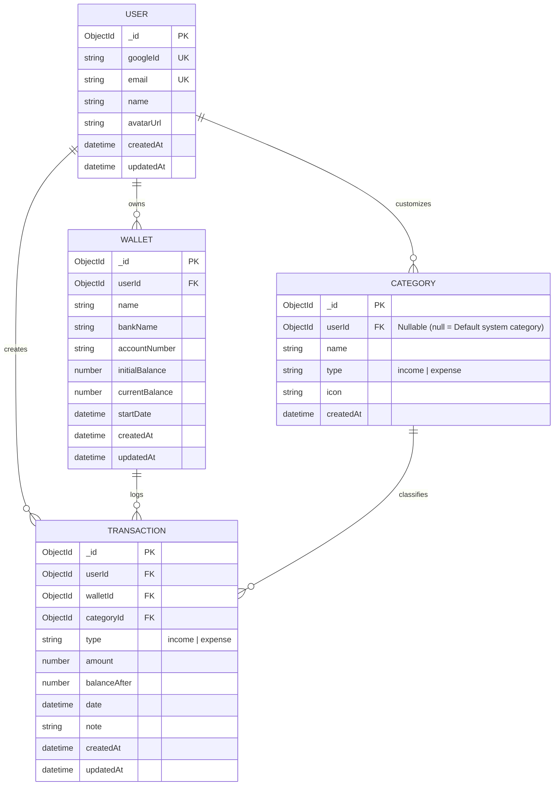

# 🗄️ Thiết kế Cơ sở Dữ liệu (Database Design)

Tài liệu này mô tả chi tiết mô hình dữ liệu MongoDB, sơ đồ thực thể liên kết (ERD), chiến lược đánh chỉ mục (Compound Indexing) và cơ chế giao dịch nguyên tử ACID.

---

## 📊 Sơ đồ Thực thể (Entity Relationship Diagram - ERD)



---

## ⚡ Chiến lược Đánh Chỉ mục Phức hợp (Compound Index Strategy)

Nhằm tối ưu hóa hiệu năng truy vấn cho bài toán **100 ví / tài khoản và hàng triệu bản ghi giao dịch**, hệ thống áp dụng các chỉ mục B-Tree chuyên biệt:

| Collection | Chỉ mục (Indexes) | Mục đích tối ưu | Độ phức tạp |
|---|---|---|---|
| **Users** | `{ googleId: 1 }` (Unique)<br/>`{ email: 1 }` (Unique) | Xác thực đăng nhập Google tức thì | $O(1)$ Hash / $O(log N)$ |
| **Wallets** | `{ userId: 1, createdAt: -1 }` | Lấy danh sách ví của User và tính Tổng số dư | $O(log N)$ |
| **Transactions** | `{ userId: 1, walletId: 1, date: -1, _id: -1 }` | **Chỉ mục cốt lõi**: Phục vụ truy vấn Lịch sử, Bộ lọc Sao kê theo ngày và xuất báo cáo Stream | $O(log N)$ |
| **Transactions** | `{ userId: 1, date: -1 }` | Lấy danh sách giao dịch gần đây trên Trang chủ | $O(log N)$ |
| **Categories** | `{ userId: 1, type: 1 }` | Lấy danh mục Thu/Chi theo người dùng | $O(log N)$ |

---

## 🔒 Cơ chế Giao dịch ACID (MongoDB Multi-Document Transactions)

Khi người dùng thực hiện giao dịch **Chi tiền (Expense)** hoặc **Gỡ ví (Delete Wallet)**:
```typescript
const session = await mongoose.startSession();
session.startTransaction();
try {
  // 1. Khóa và đọc số dư hiện tại của Ví
  const wallet = await Wallet.findOne({ _id: walletId, userId }).session(session);
  
  // 2. Chặn chi âm tuyệt đối
  if (type === "expense" && wallet.currentBalance < amount) {
    throw new AppError("Số dư trong ví không đủ để thực hiện giao dịch", 400);
  }

  // 3. Cập nhật số dư nguyên tử
  wallet.currentBalance += (type === "income" ? amount : -amount);
  await wallet.save({ session });

  // 4. Tạo bản ghi giao dịch với balanceAfter
  await Transaction.create([{ ...data, balanceAfter: wallet.currentBalance }], { session });

  await session.commitTransaction();
} catch (err) {
  await session.abortTransaction();
  throw err;
} finally {
  session.endSession();
}
```


---

## ⏱️ Thuật Toán Đồng Bộ Dòng Thời Gian (Timeline Recalculation Algorithm)

Khi người dùng **Tạo mới**, **Chỉnh sửa** (Số tiền, Loại Thu/Chi, Ngày giao dịch, Danh mục, Ghi chú) hoặc **Xóa** bất kỳ giao dịch nào:
1. **Khóa ví mục tiêu:** Giao dịch gắn liền với Ví đã tạo, **không cho phép chuyển ví (`walletId` là bất biến)**.
2. **Quét dòng thời gian theo thứ tự tăng dần:**
   ```sql
   ORDER BY date ASC, createdAt ASC, _id ASC
   ```
3. **Tính toán số dư tích lũy liên tục (Continuous Running Balance):**
   - Bắt đầu từ số dư ban đầu của Ví: `running = wallet.initialBalance`.
   - Với mỗi giao dịch $t_i$:
     $\text{running}_{i} = \text{running}_{i-1} + (t_i.\text{type} == \text{'income'} \ ? \ t_i.\text{amount} : -t_i.\text{amount})$
   - **Bảo vệ chống chi âm lịch sử (Timeline Non-Negative Invariant):**
     $\forall i, \quad \text{running}_i \ge 0$
     Nếu tại bất kỳ thời điểm nào $\text{running}_i < 0$, giao dịch lập tức bị hủy bỏ (Rollback Transaction) và trả về lỗi: *"Không thể thực hiện vì vào ngày DD/MM/YYYY, số dư ví sẽ bị âm ($X$ đ)"*.
4. **Cập nhật đồng loạt (Bulk Write):**
   - Cập nhật `balanceAfter = running_i` cho từng giao dịch trên toàn bộ dòng thời gian.
   - Cập nhật số dư hiện tại cuối cùng: `wallet.currentBalance = running_n`.