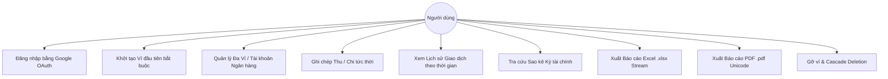

# 📌 Tổng quan Hệ thống (System Overview)

Tài liệu này mô tả tổng quan về mặt nghiệp vụ của **Hệ thống Quản lý Chi tiêu Cá nhân & Sao kê Đa Tài khoản Ngân hàng (Expense Tracker)**.

---

## 👥 Đối tượng sử dụng (Actors)

| Đối tượng | Vai trò & Trách nhiệm chính |
|---|---|
| **Người dùng cá nhân (End User)** | Quản lý dòng tiền cá nhân, tạo nhiều ví (Ví tiền mặt, các tài khoản ngân hàng), ghi chép thu/chi hàng ngày, xem lịch sử giao dịch và xuất báo cáo sao kê tài chính chi tiết. |
| **Google OAuth Provider** | Cung cấp định danh xác thực bảo mật chuẩn OAuth 2.0 (OpenID Connect), đồng bộ Avatar và thông tin hồ sơ người dùng. |
| **Hệ thống Quản trị / Docker Runner** | Môi trường triển khai tự động hóa độc lập, vận hành máy chủ, cơ sở dữ liệu MongoDB Replica Set và dịch vụ streaming báo cáo. |

---

## 🎯 Sơ đồ Ca sử dụng cốt lõi (Core Use Cases)

---

## 💼 Miền nghiệp vụ cốt lõi (Core Domain Logic)

1. **Quản lý Định danh & Phiên làm việc (Authentication & Onboarding):**
   - Đăng nhập 1-click qua Google OAuth.
   - Cơ chế cờ `requiresWalletSetup`: Bắt buộc người dùng mới phải tạo ít nhất 1 ví trước khi được truy cập vào hệ thống dashboard.

2. **Quản lý Đa Tài khoản (Multi-Wallet Management):**
   - Hỗ trợ lưu trữ nhiều tài khoản ngân hàng (Vietcombank, Techcombank, MB Bank...) và ví tiền mặt.
   - **Pre-aggregated Balance Pattern:** Cập nhật số dư hiện tại `currentBalance` ngay khi có phát sinh thu/chi, cho phép truy xuất Tổng số dư tất cả các ví với độ trễ $< 2\text{ms}$.

3. **Ghi chép Giao dịch & Bảo vệ Chống chi âm (ACID Overdraft Protection):**
   - Tự động phân loại dòng tiền: **Thu (Income)** và **Chi (Expense)**.
   - Ứng dụng **MongoDB Multi-Document ACID Transactions**: Kiểm tra số dư khả dụng và trừ tiền trong cùng 1 phiên giao dịch nguyên tử, chống race condition và chặn chi vượt quá số dư ví.

4. **Sao kê & Xuất Báo cáo Dữ liệu lớn (Streaming Statements):**
   - Tính toán chính xác **Số dư đầu kỳ**, **Tổng thu**, **Tổng chi**, **Số dư cuối kỳ**.
   - Xuất dữ liệu dạng **Stream $O(1)$ RAM**, đáp ứng hàng triệu dòng giao dịch mà không làm tràn bộ nhớ máy chủ.
